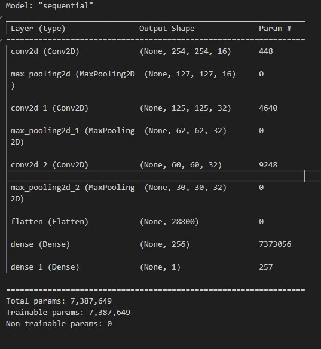
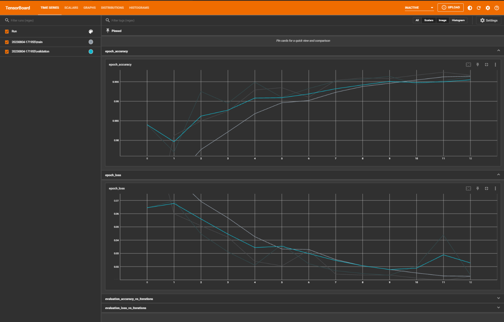

# Image-Classification-Using-Deep-Learning
Image classification of cracks dataset using Tensorflow Keras

## Overview
This project uses TensorFlow and Keras to classify images into multiple classes. 
There are several types of common concrete cracks namely hairline cracks which 
usually develop in concrete foundation as the concrete cures, shrinkage cracks which 
occur while the concrete is curing, settlement cracks which happen when part of 
concrete sinks or when the ground underneath the slab isn’t compacted properly as 
well as structural cracks which form due to incorrect design.

Concrete cracks may endanger the safety and durability of a building if not eing 
identified quickly and left untreated. Hence, your job as an AI engineer is tasked to 
perform image classification to classify concretes with or without cracks. Your 
developed model is impactful and may save thousands of lives.

## Requirements
- Python 3.8.17
- TensorFlow
- Keras
- imghdr
- numpy
- matplotlib.pyplot

## Installation
1. Clone this repository.
2. Install the required dependencies.

## Dataset
This project uses the Concrete `Crack Images for Classification` dataset, which was obtained from [[Source of Dataset]](https://data.mendeley.com/datasets/5y9wdsg2zt/2). The dataset contains 40000 samples, each consisting of an image and a corresponding label indicating the class of the object in the image. 
The dataset was preprocessed by [Description of Preprocessing Steps], resulting in a final dataset of 2 samples. The dataset was then split into training and validation sets, with 28000 samples in the training set and 8000 samples in the validation set.

The classes in the dataset are Positive(Cracks) and Negative(Not Cracks), with 20000 samples per class.

## Model
This project use the Sequential model implemented with Tensorflow Keras to classify images into multiple classes. 
The model architecture consists of several layers, including convolutional, pooling, and fully connected layers, stacked sequentially using the `Sequential` class from Keras.
The model was compiled with the `binary_crossentropy` loss function and the `adam` optimizer, and trained on the training data for a specified number of epochs. 
Here are the model summary: 

  

Model Architecure:

  

## Results
After training the model on the  `Concrete Crack Images for Classification` dataset for 20 epochs, we achieved an accuracy of 99% on the validation set. 
This demonstrates the effectiveness of our model in classifying images into their correct classes. Here are the Loss perfomance:

  

And the Accuracy perfomance:

  

This are the epoch accuracy and loss generated by using TensorBoard:
 

 

Here are the `Precision`, `Recall` and `Binary Accuracy` results:

 

## Model Deployment
The trained model can be loaded using the `load_model` function from Keras and used to make predictions on new data.
This is images that used to make test the trained model:

  

and the predictions results is Positive(Cracks):

  

